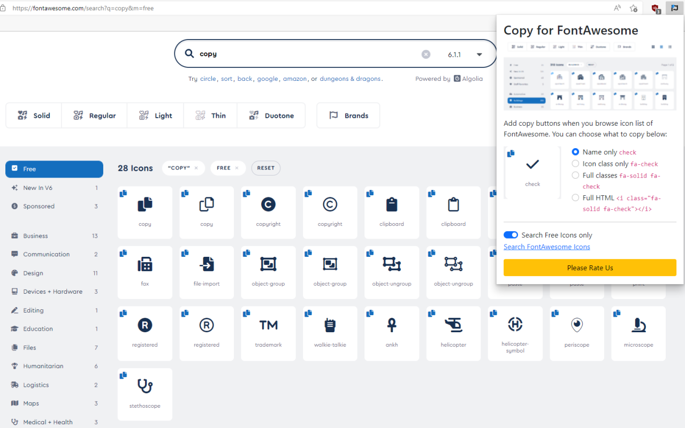

# Copy for FontAwesome

A simple Chrome/Edge Chromium extension to improve productivity for developers and designers who use [FontAwesome](https://fontawesome.com/). It creates a copy button for all icons in the Search (listing) page.



Was it helpful for you? Please consider a donation ❤️ [PayPal](https://paypal.me/datvm).

## Features

- Add copy buttons to all icons on FontAwesome's listing pages. There are 4 copy modes you can choose from:

    - Name only: `check`.

    - Class only: `fa-check`.

    - Full class: `fa-solid fa-check`.

    - Full HTML: `<i class="fa-solid fa-check"></i>`

- Quickly open the search page, optionally with Free icons only checked.

All your options are saved.

## Source Code and Build

This extension is free and open source under GNU License. It's written in TypeScript and uses ES6 module so no WebPack or other compilation beside TypeScript is needed.

### Building the final files

Even though the extension works fine after TypeScript build, many files are not needed. Run

```powershell
node .\compile-node.js
```

to create a `bin` folder with only necessary files for the extension.